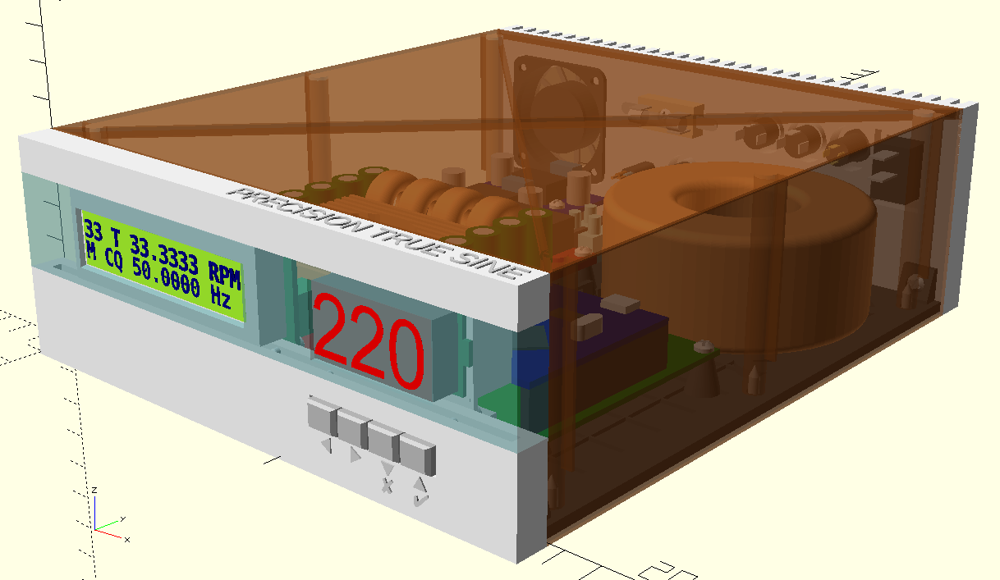
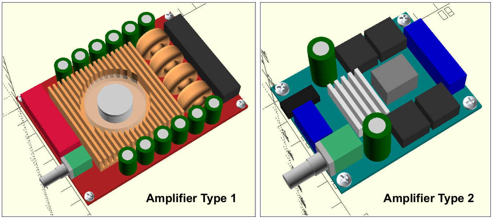
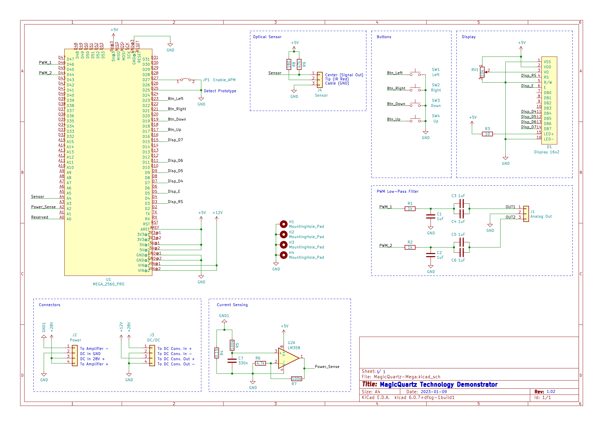
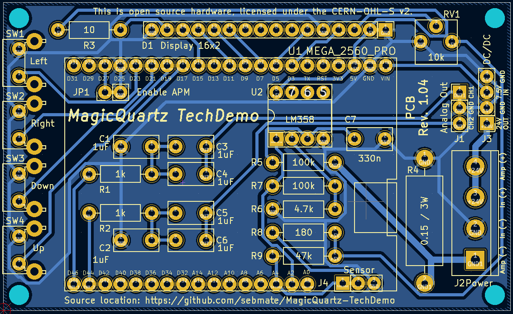
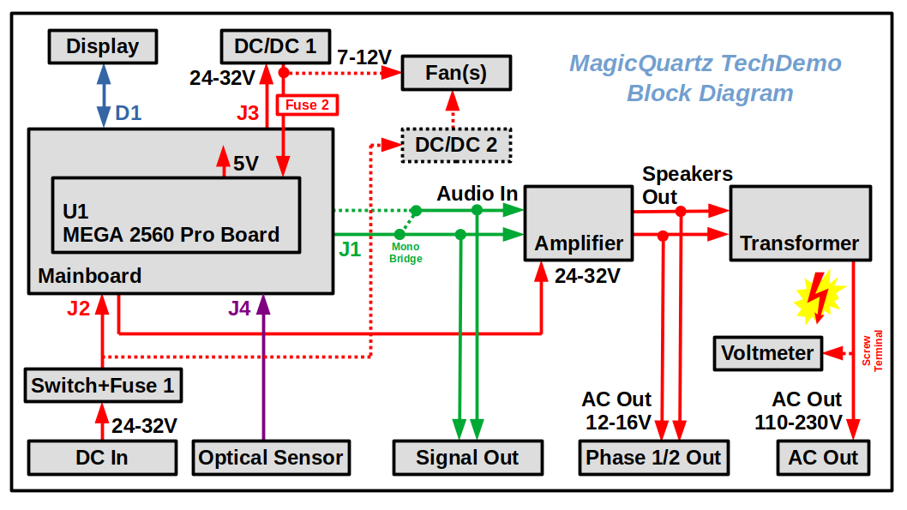

# MagicQuartz Technology Demonstration

## Introduction

This repository contains an open source hardware design of a turntable speedbox that is capable of running the proprietary [MagicQuartz](https://www.mate-labs.de/magicquartz) firmware. The hardware design consists of two parts:

* An [OpenSCAD](https://openscad.org) model that can be used for generating a 3D-printable enclosure.
* A [KiCad](https://www.kicad.org) design for the mainboard, comprising schematic and PCB.

The speedbox implements a simple AC power inverter based on a class-D audio amplifier and a toroidal transformer to step-up the voltage. The speed of the record player is controlled by changing the generated AC frequency. This enables electronic switching between the standard record speeds (16, 33, 45, and 78 RPM) and real-time speed correction using an optical sensor. Note that this approach only works for turntables with AC motor. The hardware design supports the most important features of MagicQuartz version 1.00, including the "Advanced Power Management" (APM).

## Licensing

The information and files in this repository are provided under the [CERN-OHL-S v2](cern_ohl_s_v2.txt) open source license (please click [here](https://ohwr.org/project/cernohl/wikis/Documents/CERN-OHL-version-2) for details).

## Disclaimer

The only purpose of this repository is to provide an easy-to-reproduce hardware design for demonstrating the capabilities of the MagicQuartz firmware. To date, the design has not been evaluated with respect to electrical safety, electromagnetic compliance (EMC), and fire safety. **Devices manufactured based on this design are not suitable for end users.**

There are several serious dangers associated with building and operating this device. If you do not have sufficient knowledge, please do not attempt to build or operate the device. Note that the information in this repository intentionally does not constitute assembly instructions. Also pay close attention to section 6 of the [CERN-OHL-S v2](cern_ohl_s_v2.txt) license and the safety considerations below.

## Hardware Design

### Safety Considerations

* The device is capable of generating high voltage and may cause fire and/or serious injury, including death.
* The device switches high currents using pulse width modulation (PWM), which may cause interference with other electronic devices or radio equipment.
* The device creates an [IT network (isolé-terre)](https://en.wikipedia.org/wiki/Earthing_system#IT_network). This has implications on the number of appliances (i.e. motors or turntables) and their insulation type to be safely connected to the device.
* Be very careful when performing measurements! Do not attempt to measure the high-voltage side of the transformer using an oscilloscope! There is no need to do this as the signal can be fully verified on the low-voltage side. In this regard, also note that the digital amplifier's negative outputs are not connected to ground. There is a serious risk of damaging the oscilloscope and other equipment when performing measurements while the circuit is grounded, e.g. over the Arduino's USB port and a PC. Use galvanic isolators where applicable.
* There is a serious risk that the device damages connected components. Examples are strobe lamps, which may be damaged easily by voltage spikes or excessive voltage, or fixed-frequency AC motors that rely on phase shift capacitors. There is also a risk that the PWM carrier signal passes through the audio path of a stereo system and damages the speakers. In addition, note that although software-side pop suppression is used, a voltage spike typically occurs when the device is turned on. For this reason, the device should be turned on before the turntable is turned on.
* The individual prefabricated modules (especially the amplifier, the step-down converters and the microcontroller board) may contain electronic components from different manufacturers and of varying quality (see section "Known Issues"). In the event of a hardware failure, this can lead to further unexpected consequential damage. The assembled device should therefore never be operated unattended.
* Note that the mechanical, electrical, and chemical properties of 3D-printed components may change or deteriorate over time.

### OpenSCAD 3D Model

The OpenSCAD file can be used to virtually explore the device and to 3D-print a physical enclosure.

*Note:* If the symbols on the front are not displayed correctly, the "Symbola" font has to be installed (Ubuntu package name: `fonts-symbola`).

#### Parts Overview and Printing Notes

The table below provides an overview of all 3D-printable parts in the 3D model along with some notes. Be aware that the printing time in total is around 22 hours (on an Ultimaker 2).

While the STL files are available in the `release` folder for your convenience, they can be generated easily in OpenSCAD. Set the variable `render_components` to `false` and change the value of the variable `generate` to the respective part number. Then press F5 to preview the part, F6 to render the part, and F7 to export the STL file. Note that the rendering process may take a considerable amount of time, even on fast computers. Also note that the generated objects are already properly oriented for printing.

I had some problems printing with Cura versions 5.1.1 to 5.3.0, especially with the "Back" part. The slicer created some signifcant artifacts and did not handle the text as expected (the last layer under the text was not printed as expected). I went back to 4.13.1.

In addition to the table below:

* Print all parts using "tree" support.
* Print all parts using the "grid" infill pattern (except part 3, see notes).
* Print all parts with with 0.2 mm layer height (except part 8, see notes).
* Print all parts with with adhesion type "brim" (except part 8, see notes).

| Part Nr. | Name                          | Suggested Color | Notes / Exceptions                                                                                                       |
|----------|-------------------------------|-----------------|--------------------------------------------------------------------------------------------------------------------------|
| 1        | Bottom Plate                  | Black           | May be printed without "tree" support.                                                                                   |
| 1        | Bottom Plate (Material Saver) | Black           | Saves some filament, but is less sturdy. May be printed without "tree" support.                                          |
| 2        | Front Lower Part              | White           | Set "Support X/Y Distance" to 1.6 mm to prevent the slicer from creating support in the air inlet.                       |
| 3        | Front Center Part             | Transparent     | Use the "lightning" infill pattern to create a nice "quartz-like" appearance.                                            |
| 4        | Front Upper Part              | White           |                                                                                                                          |
| 5        | Cover                         | Brown           | Print this variant if you do not plan to apply decorative foil.                                                          |
| 5        | Cover (Material Saver)        | (Any)           | If decorative foil does not adhere properly to the edges, slightly sand down the surfaces at the edges.                  |
| 6        | Foot (Print 4x)               | Silver          | May be printed without "brim".                                                                                           |
| 7        | Voltmeter Cover               | As Front        |                                                                                                                          |
| 8        | Button Assembly               | Silver          | Print with 0.1 mm or less to improve strength, do not use adhesion support (brim). Enable ironing on top layer.          |
| 9        | Back                          | White           |                                                                                                                          |
| 10       | Dummy sockets                 | As Back         | Print without "brim".                                                                                                    |
| 11       | Optical Sensor Case           | Black           |                                                                                                                          |

#### Components
The components to be used should be easily identifiable from the OpenSCAD and KiCad projects. For components where this is not immediately obvious, here are some details:

* **Screws:** All parts can be held together with self-tapping screws type "DIN 7981 C H", 2.9x9.5 mm, except for the LCD and voltmeter cover, where 2.2x9.5 mm should be used. The DIN screws can of course also be substituted with similar compatible screws.
* **Cable Ties:** The enclosure has been designed to mount various components with cable ties, such as the transformer, the internal fan (only used for amplifier type 2), the high-voltage screw terminal, and to secure the AC out cable. The bar in the center of the enclosure can be used to attach wires with cable ties.
* **Amplifiers:** The OpenSCAD design currently supports the accommodation of two types of digital power amplifier boards based on the TDA7498 and TPA3116D2 chips, respectively (see renderings below). The first type seems to be very fragile and requires about 28V. The second type is more robust and works well at 24V, but has more noise and definitely needs a better heatsink. However, it is possible to modify the design to accommodate other types. There is also a third "placeholder" type that can be used for custom developments.
* **Toroidal Transformer:** Type "RKT 5012" (50VA, 220V to 2x12V). To distribute the load across both amplifier channels, the two 12V transformer windings can be driven in parallel via the two output channels of the amplifier. It is then important to ensure that the two windings are actually driven in parallel and not in reverse. Given a connection sequence of "R+, R-, L+, L-" at the amplifier, a working wiring sequence is "red, yellow, blue, green" for the RKT 5012. Caution! During operation, the 220V tappings are live.
* **AC Voltmeter:** Type "YB27A", 60-300V AC, removed from its original housing. Note that the voltmeter is live and there is a risk of electric shock. If the wires need to be extended or replaced, make sure they have the proper voltage rating.
* **Power Switch:** Type "KCDI-101".
* **DC/DC Converter Boards:** Step-down voltage regulator boards based on the LM2596S (also see "Known Issues" below).
* **Fuses**: Fuse 1 is covers the entire circuit and should be sized according to the implemented power rating. For example, if a 50VA transformer and a 24V power supply are used, a 2A fuse may be appropriate. Fuse 2 is used to protect the components on and connected to the "MEGA 2560 PRO" board, which draw approximately 100mA at 7.5V. Using a 125mA fast-acting fuse is therefore reasonable.

### KiCad Schematic and PCB

This repository also contains an electronic circuit for a mainboard. The PCB was designed for rapid prototyping and can be produced single-sided, e.g. with a small CNC or by etching. However, an optional top copper layer can be used to improve shielding. Of course, the PCB can also be manufactured by any PCB manufacturer.

The mainboard is build around the "MEGA 2560 PRO" board (denoted U1 in the schematic). To the author's knowledge, this board was originally developed by RobotDyn. Unfortunately, it seems to be no longer available, but re-makes by other companies are widely available. Click [here](https://robotdyn.com/mega-2560-pro-embed-ch340g-atmega2560-16au.html) for an archived version of RobotDyn's webpage.

The electronic circuit is very simple and should be self-explanatory. However, the following points explain some special aspects:

* **Power Supply:** Connector J2 ("Power") is used to power the mainboard from an external power source via pins 2 and 3 (typically 24-32V, depending on the voltage requirements of the amplifier, labeled "+24V" in the schematic). Connector J2 is also used to power the amplifier board via pins 1 and 4. Notice that pin 1 of J2 is connected to a second ground (GND1), which is used to measure the amplifier current (see below).
* **DC/DC Converter Boards:** As described above, the mainboard is supplied with 24-32V (labeled "+24V"). The U1 board, however, requires a voltage between 7V and 12V (labeled "+7.5V"). Because it is not practical to overcome the large voltage difference with a linear regulator, connector J3 ("DC/DC") can be used to connect an external DC/DC step-down converter board (see OpenSCAD design). U1 then uses its on-board linear voltage regulator (AMS1117) to create the 5V. The enclosure can accommodate a second DC/DC converter board specifically to power the fans; however, if the fans run well with the voltage from the first board, they can also be connected to this first converter board.
* **Jumper "Enable APM":** Digital pin D27 of U1 can be pulled to GND (jumper J1 "Enable APM" is closed) to tell the firmware that the current sensing circuit is available, which allows the firmware to detect whether the turntable motor is currently powered or not.
* **Current Measurement:** The current measurement works as follows: The current of the power section (the digital amplifier board) is measured via the voltage drop across resistor R4 (0.15 Ohm, 3W). The measured voltage is low-pass filtered via C7 and R5 and brought via U2A to a voltage level that can be easily measured by the microcontoller's ADC. 
* **Low-Pass Filter:** The PWM low-pass filter section converts the PWM signals from the microcontroller into one or two analog sine waves using simple RC filters. The filters are designed to have a cutoff frequency of about 200 Hz, which is high enough to pass any of the possible AC frequencies but block the PWM carrier signal. The filter is implemented twice in case a dual-phase inverter is to be implemented (which requires an additional transformer and a different enclosure). For single-phase configurations, it is recommended to equip only one filter section and bridge the two channels at the input of the amplifier. This eliminates the risk of damaging the amplifier if the user accidentally changes the phase shift in the firmware.

### Block Diagram

Here is a block diagram that provides an overview of all internal connections:

## Known Issues

### AMS1117 Voltage Regulator

The "MEGA 2560 PRO" board may use an "AMS1117" 5V voltage regulator of questionable quality (see [this](https://goughlui.com/2021/03/27/note-linear-regulator-woes-when-is-an-ams1117-not-an-ams1117) interesting blog post). The regulator may fail with a full or partial internal short and pass the input voltage (7.5V) to the rest of the circuit. This may not only damage the other components (including the ATmega2560), it may also increase the level of the sinusoidal signal generated. As a result, the inverter may generate excessive voltage and damage the turntable.

The problem may be solved via these approaches:

* **Simple and probably sufficient:** By replacing the AMS1117 with another "1117"-type regulator from a renowned manufacturer (e.g. LM1117 by Texas Instruments or TS1117 by Taiwan Semiconductor), purchased from a reputable electronics distributor. Depending on the regulator used (see data sheet), additional 10uF tantalum capacitors may need to be added to the input and output pins of the regulator. Such a modification based on an TS1117 is shown in this image: [images/TS1117-Modification.jpg](images/TS1117-Modification.jpg). Notice the two new yellow tantalum capacitors and the additional fuse (see below). The old AMS1117 is easily desoldered by applying excess fresh solder to the three pins, heating it up, and then wiping everything away. Carefully observe the polarity of the capacitors!
* **More sophisticated:** By adding a "crowbar circuit" (see [this](https://circuitdigest.com/electronic-circuits/crowbar-circuit-diagram) link for an excellent description) and a fuse to the design to provide additional protection. The "crowbar circuit" may be supplied as a small piggyback board for the "MEGA 2560 PRO" board to provide compatibility with the current mainboard (Rev. 1.02). Such an add-on is available here: [https://github.com/sebmate/LittleJimmy](https://github.com/sebmate/LittleJimmy). *Note: The crowbar circuit is currently work in progress and has not yet been tested. It may be added to future revisions of the mainboard.*

The fuse is actually only needed for the second solution, but there is nothing wrong with adding it in general. The above block diagram and the rear panel of the enclosure have already been extended to incorporate this fuse. As described above, as the circuit is drawing about 100mA at 7.5V, using a 125mA fast-acting fuse is reasonable.

### LM2596S DC/DC Converter Boards

These inexpensive step-down boards probably don't use original LM2596S ICs (see [this](https://k6jca.blogspot.com/2018/02/counterfeit-lm2596-regulator-boards.html) link for more information). So far, however, I have had no issues with these. The above described crowbar circuit, when installed on the "MEGA 2560 PRO" board, also provides some protection against a possible failure of such an LM2596S DC/DC converter board.

## Parts Lists

Parts lists are available in the directory `parts-lists`.

One of the lists is for the German electronics distributor Reichelt. This list can also be accessed directly via this link: [https://www.reichelt.de/my/2038407](https://www.reichelt.de/my/2038407). This list also contains alternative parts that are not essential. The list should therefore not be ordered blindly. Please note that I am not affiliated with Reichelt and am only providing this list for your convenience. The parts may be available from other vendors at a lower price.

## Assembly Notes

* Assume that the assembly will take about two evenings, once you have all parts in place.
* The combination of mainboard and display can be fully tested without anything else being connected to it (such as the cabling to the rear panel, the amplifier, the DC/DC converter). This works by powering the "MEGA 2560 PRO" board via USB.
* Manual wiring of the display is very time-consuming. You may prefer to use a connector-based solution. Note that not all 16 display lines are required.
* Before connecting and powering the mainboard and the fans via the DC/DC converters, it is essential to set the voltages on them beforehand (e.g., to 7.5V, as described above).
* The specified screw for the fuse holder may be too long and may break through the rear panel. Be careful when mounting the fuse holder and consider using a shorter screw.
* Pictures of an assembled device are available in the `images` folder. Note that these do not yet show the latest revision with the LittleJimmy circuit and the second fuse.

## Initialization Procedure

The following steps describe how to initially setup the device:

* Before turning on the power for the first time, turn the amplifier board volume control all the way down.
* Follow the instructions in Section 4, "Getting Started", of the MagicQuartz documentation for flashing the firmware and executing the motor setup.
* When the "Motor Setup" routine asks you about the wave form (parameter `WaveForm`), set this to 2.
* When it comes to setting the voltage (parameter `VoltageMtOn`), the documentation says that the steps depend on whether the inverter installed in the speedbox has a level control or not. It has: it's the volume control of the amplifier. Proceed as described in the documentation: Set `VoltageMtOn` to 1, then slowly and carefully turn up the volume control of the amplifier until the desired voltage (e.g., 220V) is reached. If the amplifier switches into the protection state, try again.
* The inverter shutdown detection can be tested as described in section 4.3 of the software documentation by setting a too low `RampingSpeed` value and then restarting the inverter. If it does not work and if the measured current values in the firmware are on the lower end of the measuring range (which is from 0 to 1023), you may replace R7 with a higher value resistor, such as 470 kOhm.
