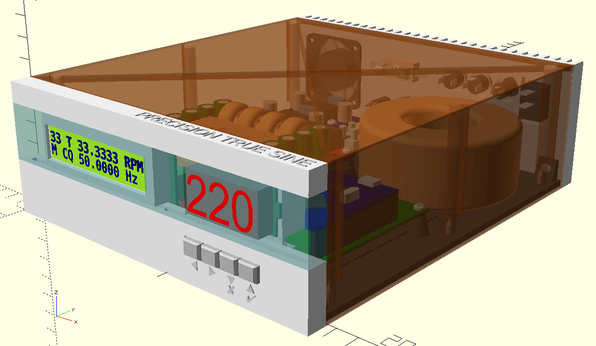
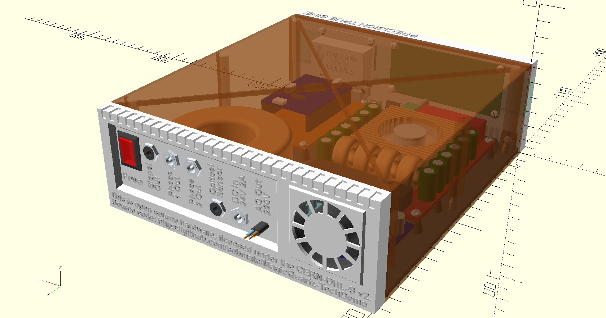
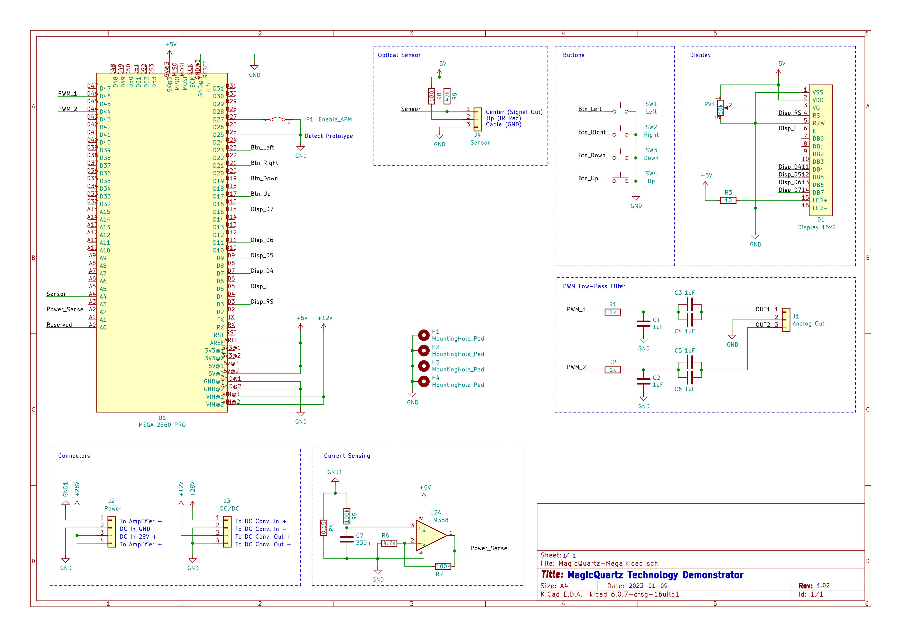
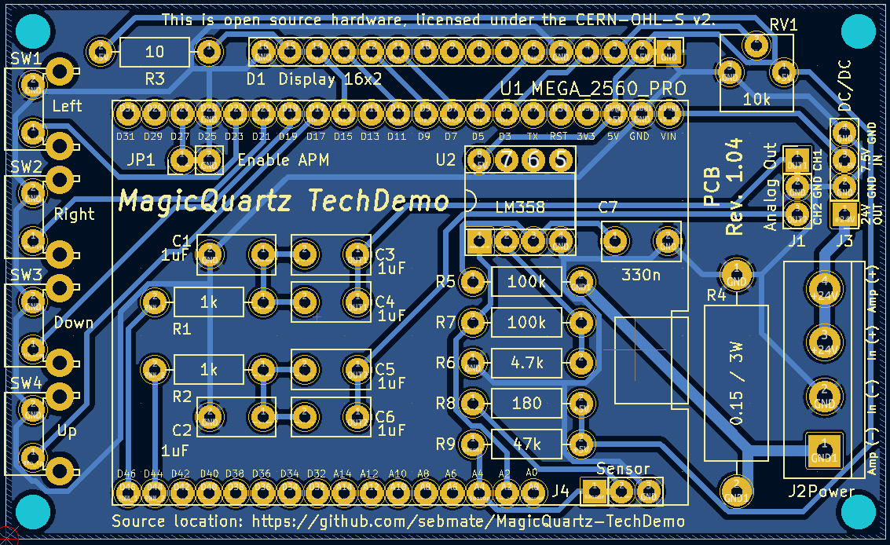

# MagicQuartz Technology Demonstrator

## Introduction

This repository contains an open source hardware design for a turntable speedbox that is capable of running the [MagicQuartz firmware](https://www.mate-labs.de). The speedbox, which is actually an ultra-precision true sine power inverter, actively regulates the AC frequency to control the turntable's speed. An optical sensor is used to measure the rotation speed of the turntable's platter.

The hardware design consits of two parts:

* An [OpenSCAD](https://openscad.org) model that can be used for generating 3D-printable parts and for making nice renderings of the device (as in the picture above). Note that the printing the enclosure is very time-consuming.
* A [KiCad](https://www.kicad.org) design for the mainboard (schematic and PCB). The PCB has been designed for rapid prototyping. While an optional second (top) copper layer may be used to improve shielding, the circuit can be fabricated single-sided using a small CNC or via etching. Of course, the board can also be fabricated by any PCB manufacturer.

Please note that the MagicQuartz firmware can also be run directly on standard Arduino hardware, such as an Arduino Mega 2560 Rev3 board and an LCD shield, or by using the Arduino's serial TTY. It is not necessary to build the device presented here to get started with the firmware. See [https://www.mate-labs.de](https://www.mate-labs.de) for details.

## Licensing

The information and files in this repository are provided under the CERN-OHL-S v2 open source license (please click [here](https://ohwr.org/project/cernohl/wikis/Documents/CERN-OHL-version-2) for details).

## Disclaimer

The purpose of this repository is to provide a technology demonstration that is near to a final product in terms of aesthetics, haptics, and functionality, but not necessarily in other terms, such as electrical safety, electromagnetic compliance (EMC), and others. No warranty of any sort can be given -- please review Section 6 of the [CERN-OHL-S v2](cern_ohl_s_v2.txt) license. Devices constructed on the basis of this design should never be considered fit for the end user.

If you build the device, you act on your own responsibility. Therefore, be sure to consider the following aspects: 

* Depending on the configuration (see below), the device may generate life-threatening, high voltages. Although great care was taken into account, its electrical safety has not been evaluated.
* The device may switch high currents using pulse width modulation (PWM), which may cause interference with other electronic devices and radio equipment. The electromagnetic compliance (EMC) has not been evaluated.
* The mechanical and thermal properties of the device, including fire safety, have not been evaluated. It should also be noted that the mechanical, electrical, and chemical properties of 3D-printed components may change and/or deteriorate over time.
* The technology demonstrator uses hardware components outside of their specifications and intended use. For example, an audio amplifier is used to step-up AC voltage via a transformer that is wired in reverse.
* Assembled devices based on the information presented here may only be used under supervision and under controlled conditions.

The information in this repository does not constitute assembly instructions. If you do not have sufficient knowledge (e.g. in electronics), do not attempt to build the device.

## Hardware Design

### Hardware Configurations

The design in this repository has been prepared to allow for the construction of various configurations. The table below contains a list of these.

| Type | Name                               | Description                                                                                                                                                                                                                                                                                                                                                                      | Amplifier | Transformer | Power Supply     | AC Voltmeter       |
|------|------------------------------------|----------------------------------------------------------------------------------------------------------------------------------------------------------------------------------------------------------------------------------------------------------------------------------------------------------------------------------------------------------------------------------|-----------|-------------|------------------|--------------------|
| 1    | Signal Generator Unit              | Only generates a sine signal (one or two channels) that is routed to the "Signal Out" jack on the back panel. The amplifier and step-up stages may be part of another device.                                                                                                                                                                                                    | No        | No          | 5V or direct USB | No                 |
| 2    | Single/Dual Phase Low Voltage Unit | As type 1, but with an additional power amplifier to drive a single or dual phase AC low voltage (e.g., 12V) turntable motor. The amplified signals are routed to the "Phase 1/2 Out" jacks.                                                                                                                                                                                     | Yes       | No          | Typ. 24-30V      | Yes (low voltage)  |
| 3    | Single Phase High Voltage Unit     | **Probably the most common variant**, for which this tech demo has been optimized. Generates a high voltage AC (110-220V) to drive a single phase turntable motor. The AC is routed to an external socket via the "AC Out 220V" (you may change this to 110V) cable on the back of the device.                                                                                   | Yes       | Yes         | Typ. 24-30V      | Yes (high voltage) |
| 4    | Dual Phase High Voltage Unit       | Because there isn't enough room in the design for a second transformer, the two transformers (one for each phase) should be placed in a second and third cabinet, into which the amplifier's high-power, low-voltage AC signals are routed. These "transformer-only" enclosures have yet to be designed, although a design based on the original one should be simple to create. | Yes       | No          | Typ. 24-30V      | Yes                |

### OpenSCAD 3D Model

The OpenSCAD file can be used to virtually explore the device and to create 3D printable parts.

Note: If the symbols on the front are not displayed correctly, the "Symbola" font has to be installed (Ubuntu package name: `fonts-symbola`).

#### Parts Overview and Printing Notes

The table below summarizes all 3D-printable parts of the 3D model along with some printing recommendations (these may be refined in the near future). The numbers are based on Cura 4.13.1 using an Ultimaker 2 (the old model, not the "Plus") and all recommendations below were based on the "Draft" profile.

While the STL files are available in the `release` folder for your convenience, they can be generated easily in OpenSCAD. Set the variable `render_components` to `false` and change the value of the variable `generate` to the respective part number. Then press F5 to preview the part, F6 to render the part, and F7 to export the STL file. The rendering may take a considerable amount of time. The generated objects are already properly oriented for printing.

In addition to the table below:

* Print all parts using "tree" support.
* Print all parts using "grid" infill pattern (except part 3, see notes).
* Print all parts with with 0.2 mm layer height (except part 8, see notes).
* Print all parts with with adhesion type "brim" (except part 8, see notes).

| Part Nr. | Name                   | Suggested Color | Notes / Exceptions                                                                                                          | Printing Time | Total |
|----------|------------------------|-----------------|-----------------------------------------------------------------------------------------------------------------------------|---------------|-------|
| 1        | Bottom Plate           | Black           |                                                                                                                             | 05:57         | 05:57 |
| 2        | Front Lower Part       | White           |                                                                                                                             | 02:40         | 02:40 |
| 3        | Front Center Part      | Transparent     | Use the "lightning" infill pattern to create a beautiful crystalline appearance.                                            | 01:46         | 01:46 |
| 4        | Front Upper Part       | White           |                                                                                                                             | 01:08         | 01:08 |
| 5        | Cover                  | Brown           | Decorative foil may not adhere properly to the edges, so I recommend the material saver variant.                            | 09:21         |       |
| 5        | Cover (Material Saver) | Don’t Care      | Cover the framework with thin cardboard (about as thick as a record sleeve) and then use decorative foil (e.g. wood grain). | 04:18         | 04:18 |
| 6        | Foot (Print 4x)        | Silver          |                                                                                                                             | 00:09         | 00:36 |
| 7        | Voltmeter Cover        | Don’t Care      |                                                                                                                             | 00:43         | 00:43 |
| 8        | Button Assembly        | Silver          | Print with 0.1 mm or less to improve strength, do not use adhesion support (brim). Enable ironing on top layer.             | 00:39         | 00:39 |
| 9        | Back                   | White           |                                                                                                                             | 04:03         | 04:03 |
|          |                        |                 |                                                                                                                             |               | 21:50 |

#### Assembly

All parts are held together with self-tapping screws type "DIN 7981 C H", 2.9x9.5 mm, except for the LCD and voltmeter cover, for which 2.2x9.5 mm are used. The DIN screws can of course also be replaced by similar compatible screws.

The three parts of the front panel (2-4) are held together via the LCD and the voltmeter cover.

The transformer and the internal fan (for amplifier type 2) are held down with cable ties. The bar in the middle of the housing can be used to attach cables with cable ties.

#### Components

The 3D model contains renderings of electrical or electronic components. These are visible if the `render_components` variable is set to `true`. Changing other variables, such as `amplifier_type`, may affect the appearance of some components ( such as the internal fan) in the rendering. Depending on the hardware configuration (see above) not all parts may be needed.

* **Mainboard**: The PCB for which the KiCad schematic and layout is available in this repository, see below.
* **Amplifier**: The design currently supports three amplifier types:
    * **TDA7498-based Amplifier (Type 1):** Nice design with fan, but quite expensive, requires higher DC voltage (29-30V), and dies regularly. There also seem to be cheaper copies, which are probably fakes. The good ones carry the brand name "SANWU".
    * **TPA3116D2-based Amplifier (Type 2):** Cheaply made, more noisy, and requires a better heat sink. But it works fine at 24V and seems to be more robust. Use an additional internal fan.
    * **Custom Amplifier (Type 3):** For future developments. Has the same size as the mainboard.
* **Transformer:** A toroidal transformer, e.g. 230V to 2x12V, 50VA. Must match the power configuration of the device. Used in reverse to step-up the voltage.
* **High Voltage Screw Terminal:** Connects the high voltage side of the transformer to the voltmeter and AC output cable on the back. The screw terminal can be glued to the bottom (pay attention to the electrical and hygroscopic properties of the glue) and additionally secured with cable ties after the cables are attached.
* **DC to DC Converters:** Serve to supply the mainboard (7V) and the fans. If the fans run well at 7V, you can connect the fans to the converter that supplies the mainboard; in this case, the second converter is not necessary.
* **Fans:** The fans should have a size of 40x40x10 mm. Using 12V fans makes sense, as they seem to run well with the mainboard's supply voltage (7V). The exhaust fan on the back has to be glued in so that the warm air is pulled out of the case. The internal fan (for amplifier type 2) is fixed with cable ties and blows onto the amplifier.
* **Fuse:** Used to protect the whole unit. Must match the power configuration of the device. When using a 50 VA transformer and a 24V/2A power supply, a 2A fuse (or a little less) should work. Please do the final math on your own.
* **LCD:** Standard 2x16 LCD.
* **Voltmeter:** A three-digit LED AC voltmeter, rated 60-300V, removed from its original housing. Type "YB27A". The voltmeter is live, thus there is a risk of electrical shock.Make sure that the new wires are qualified for the voltage rating and that everything is correctly isolated when extending or replacing the wires. 

* **Back Panel:** The rear panel should be fully populated to block unwanted incoming airflow.
    * **Power Switch:** Used to turn the unit on and off. Type KCDI-101.
    * **Signal Out Jack:** 3.5 mm stereo socket that internally connects to the low-pass-filtered sine wave signal(s) that is/are generated by the mainboard.
    * **Phase 1 and 2 Out Jacks**: 5.5 / 2.5 mm DC power jacks that connect to the loudspeaker terminals of the amplifier.
    * **Optical Sensor Jack**: 3.5 mm stereo socket that provides the signal from the optical sensor to the mainboard.
    * **DC In Jack**: 5.5 / 2.5 mm DC power jack to which an external power plug (e.g. 220V AC to 24V DC) is connected.
    * **AC Out Cable Feedthrough**: Feedthrough for a cable connected to the high voltage screw terminal inside the device and providing a socket for the turntable at the other end.

### KiCad Schematic and PCB

In addition to the enclosure above, this repository also provides an electronic circuit, the "mainboard", which can run the MagicQuartz firmware and which can be built into the enclosure. The circuit implements a very simple digital to analog converter (DAC) based on an RC low-pass filter, which provides the sine signal to the digital amplifier. It also features an optional current sensing section, which allows the firmware to detect whether the turntable motor is currently powered or not ("Advanced Power Management", APM).

For the sake of simplicity, the design is build around the excellent "MEGA 2560 PRO" board (denoted U1 in the schematic). This board can be flashed with the MagicQuartz firmware easily via its USB interface and is plugged onto the mainboard, while making use of only the outer pins. Unlike other Arduino boards, this one has a real quartz oscillator, which ensures timing accuracy.

The PCB routing was done with the open source software FreeRouting (see [https://freerouting.org](https://freerouting.org)). 

#### Description of the circuit:

* The daughterboard U1, the "MEGA 2560 PRO" board, is powered via its internal voltage regulator from the nominal 12V rail, coming from one of the external DC-to-DC power converter boards via connector J3. As described above in section "Components", part "Fans", instead of using the nominal 12V, the voltage may be reduced to 7V, which allows one to also connect the fans to this line. The voltage should be at least 2V higher than the Arduino's 5V so that its voltage regulator works fine.
* The MagicQuartz firmware is / can be configured as follows:
    * Digital Pin D25 is pulled to GND to tell the firmware that it is not running on a standard Arduino board and a display shield, but on the tech demo hardware. This reconfigures the firmware so that it can interface with the display and buttons.
    * Digital Pin D27 pulled to GND (jumper J1 "Enable APM" is closed), which tells the firmware that the optional current sensing circuit is available, which allows the firmware to detect whether the turntable motor is currently powered or not. The current measurement (see below) is optional.
* The current measurement works as follows: The current of the power section (the digital amplifier board) is measured via the voltage drop across resistor R4 (0.15 Ohm, 5 Watt). The measured voltage is low-pass filtered via C7 and R5 and brought via the operational amplifier U2A to a voltage range that can be measured by the microcontoller running the MagicQuartz firmware.
* The PWM low-pass filter section converts the PWM signals from the microcontroller into analog sine waves using simple RC filters. The filters are laid out for a cut-off frequency of approx. 200 Hz. The filter is implemented twice in case a two-phase inverter configuration is to be implemented (cf. "Type 4" in the first table). In single-phase configurations, only one filter should be populated and the mono signal should be fed to both stereo channels of the digital amplifier.
